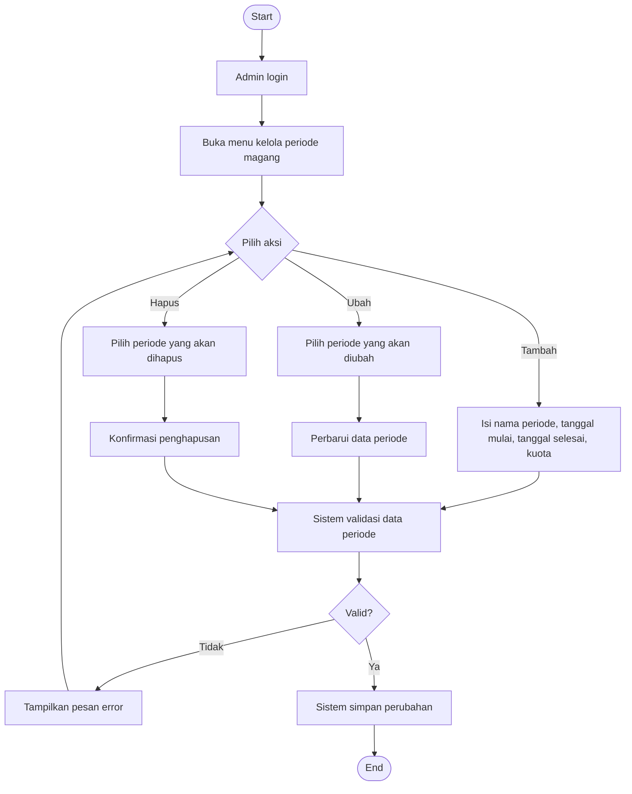

# Flowchart - Admin - Kelola Periode Magang

Fokus fitur ini hanya pada pengelolaan data periode magang oleh admin.

## Narasi Singkat

1. Admin mengelola periode magang melalui aksi tambah, ubah, atau hapus.
2. Sistem memvalidasi data sebelum perubahan disimpan.
3. Alur selesai saat data periode berhasil diperbarui.
