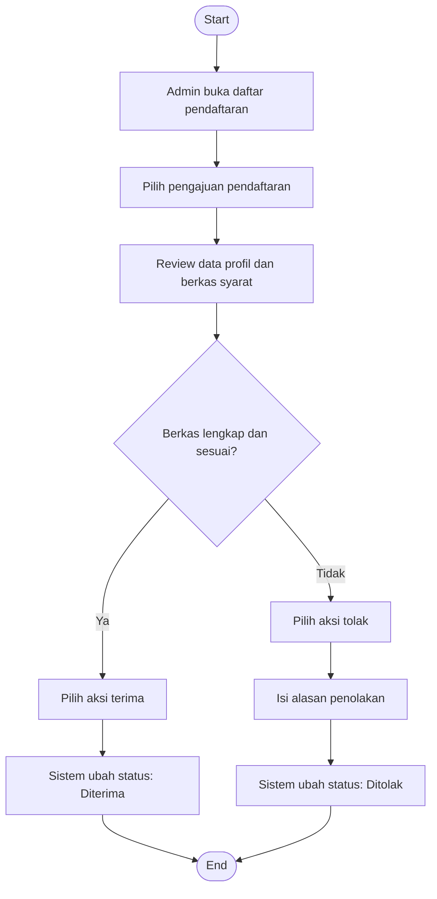

# Flowchart - Admin - Validasi Pendaftaran

Fokus fitur ini hanya pada proses admin saat memvalidasi pendaftaran mahasiswa.

## Narasi Singkat

1. Admin memeriksa pengajuan berdasarkan data dan kelengkapan berkas.
2. Jika sesuai, admin menerima pendaftaran.
3. Jika tidak sesuai, admin menolak dengan alasan yang tercatat.
