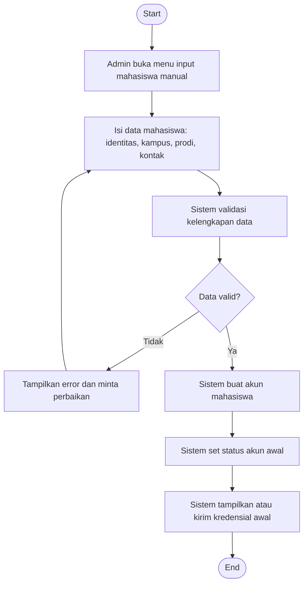

# Flowchart - Admin - Input Mahasiswa Manual

Fokus fitur ini hanya pada input mahasiswa jalur manual oleh admin.

## Narasi Singkat

1. Admin memasukkan data mahasiswa yang tidak melalui registrasi mandiri.
2. Sistem memvalidasi data lalu membuat akun mahasiswa.
3. Kredensial awal disediakan agar mahasiswa dapat login.
