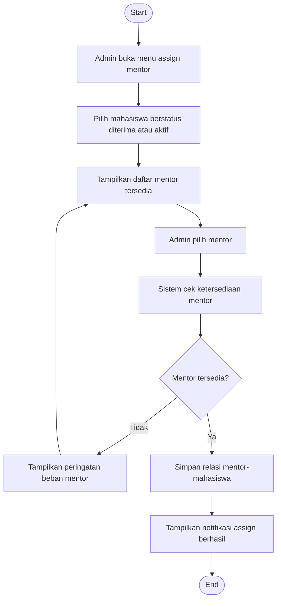

# Flowchart - Admin - Assign Mentor

Fokus fitur ini hanya pada penetapan mentor ke mahasiswa yang sudah diterima.

## Narasi Singkat

1. Admin memilih mahasiswa yang perlu pembimbing.
2. Admin menetapkan mentor dari daftar mentor yang tersedia.
3. Sistem menyimpan relasi mentor-mahasiswa setelah validasi.
