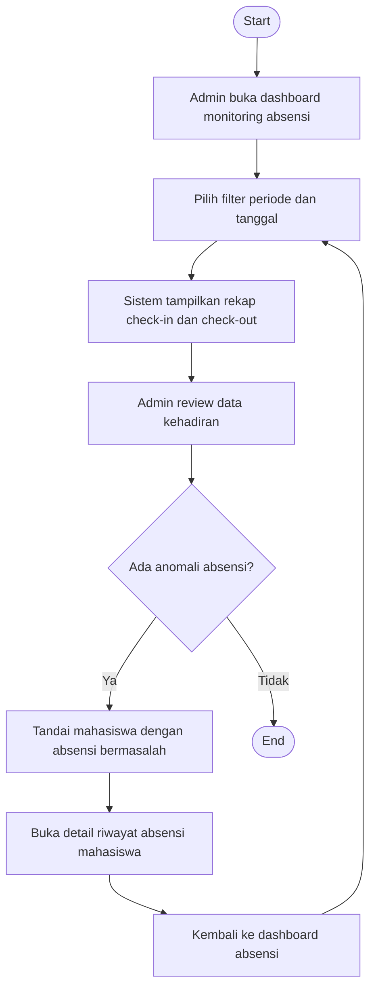

# Flowchart - Admin - Monitoring Absensi

Fokus fitur ini hanya pada pemantauan data kehadiran mahasiswa oleh admin.

## Narasi Singkat

1. Admin memfilter data absensi berdasarkan periode dan tanggal.
2. Sistem menampilkan rekap kehadiran untuk ditinjau.
3. Jika ditemukan anomali, admin membuka detail riwayat untuk pemeriksaan lanjut.
