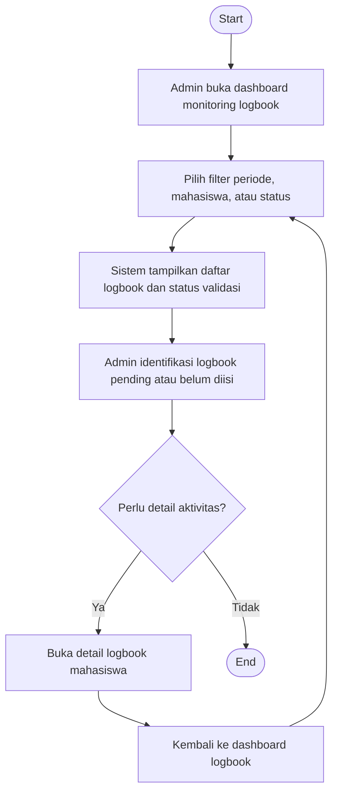

# Flowchart - Admin - Monitoring Logbook

Fokus fitur ini hanya pada pemantauan progres logbook mahasiswa oleh admin.

## Narasi Singkat

1. Admin memantau logbook menggunakan filter status dan periode.
2. Sistem menampilkan logbook yang sudah divalidasi maupun yang masih pending.
3. Admin dapat membuka detail untuk melihat kendala pengisian logbook.
