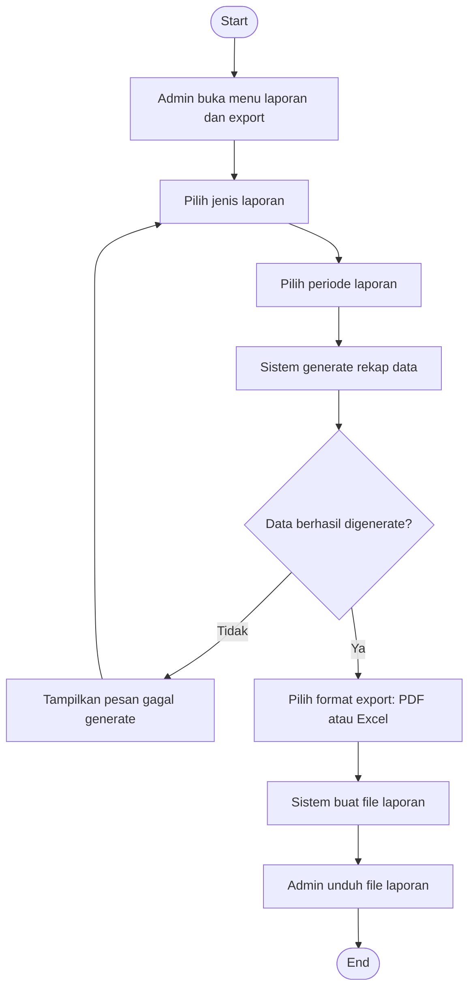

# Flowchart - Admin - Laporan dan Export

Fokus fitur ini hanya pada pembuatan laporan dan proses export data oleh admin.

## Narasi Singkat

1. Admin memilih jenis laporan dan periode data yang dibutuhkan.
2. Sistem membentuk rekap data sesuai filter.
3. Admin mengekspor hasil ke PDF atau Excel untuk kebutuhan pelaporan.
