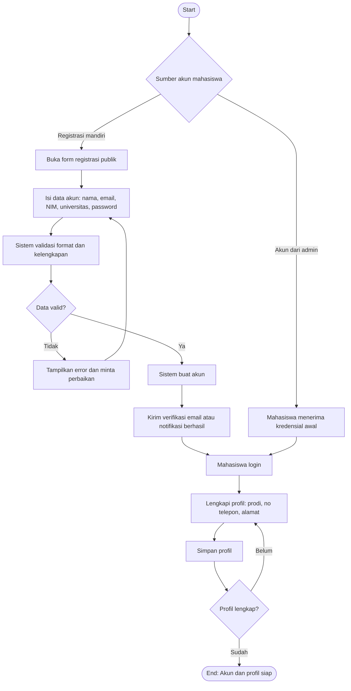

# Flowchart - Mahasiswa - Registrasi dan Profil

Fokus fitur ini hanya pada pembuatan akun dan pelengkapan profil mahasiswa.

## Narasi Singkat

1. Mahasiswa bisa memperoleh akun lewat registrasi mandiri atau akun yang dibuat admin.
2. Pada jalur mandiri, sistem memvalidasi data sebelum akun dibuat.
3. Setelah akun tersedia, mahasiswa login dan melengkapi data profil.
4. Alur selesai saat profil sudah lengkap dan siap dipakai ke fitur pendaftaran.
