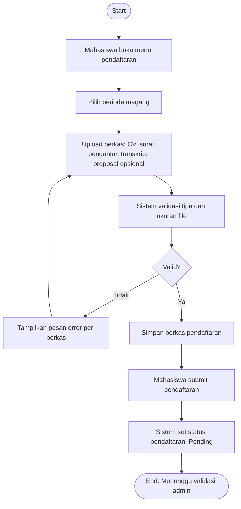

# Flowchart - Mahasiswa - Pendaftaran dan Berkas

Fokus fitur ini hanya pada pengajuan pendaftaran dan kelengkapan berkas.

## Narasi Singkat

1. Mahasiswa memilih periode dan mengunggah berkas syarat.
2. Sistem memvalidasi berkas sebelum pendaftaran bisa dikirim.
3. Setelah submit, status pendaftaran menjadi Pending.
