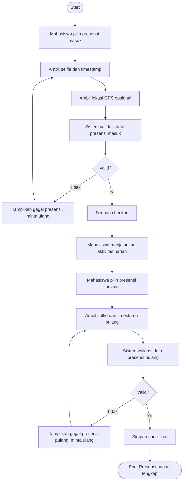

# Flowchart - Mahasiswa - Presensi Harian

Fokus fitur ini hanya pada alur presensi masuk dan presensi pulang.

## Narasi Singkat

1. Mahasiswa melakukan check-in dengan bukti selfie dan waktu.
2. Sistem memvalidasi data sebelum menyimpan presensi masuk.
3. Di akhir hari, mahasiswa melakukan check-out dengan proses validasi yang sama.
