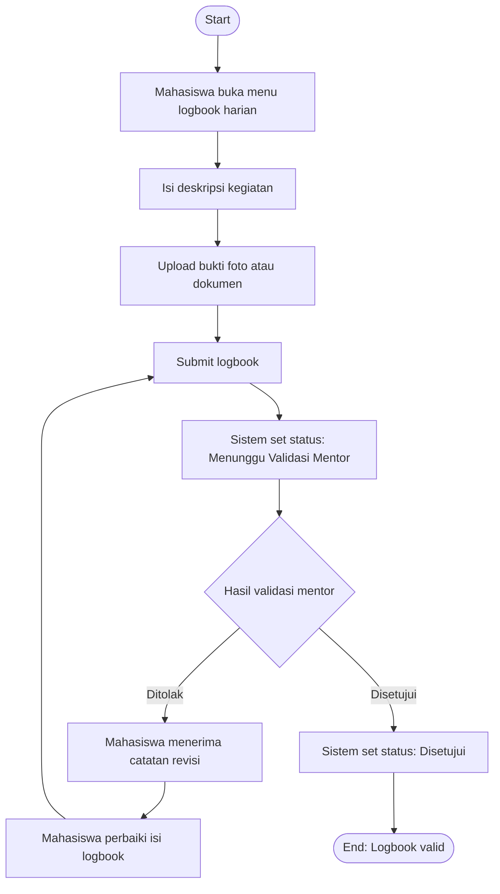

# Flowchart - Mahasiswa - Logbook Harian

Fokus fitur ini hanya pada pengisian logbook dan siklus revisi validasi mentor.

## Narasi Singkat

1. Mahasiswa mengisi aktivitas harian dan mengunggah bukti pendukung.
2. Logbook dikirim dengan status menunggu validasi mentor.
3. Jika ditolak, mahasiswa revisi lalu kirim ulang sampai disetujui.
