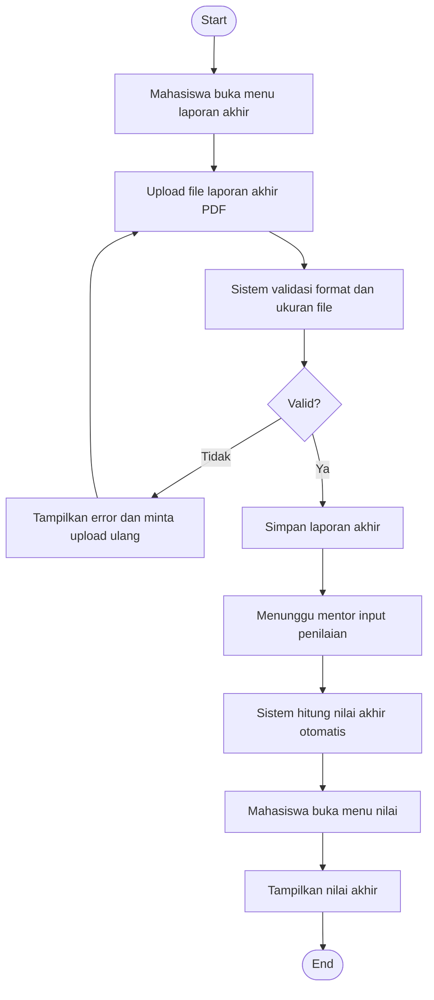

# Flowchart - Mahasiswa - Laporan Akhir dan Nilai

Fokus fitur ini hanya pada unggah laporan akhir dan akses hasil nilai.

## Narasi Singkat

1. Mahasiswa mengunggah laporan akhir dalam format yang ditentukan.
2. Sistem menyimpan laporan jika valid, lalu menunggu penilaian mentor.
3. Setelah nilai diproses, mahasiswa dapat melihat nilai akhir di sistem.
