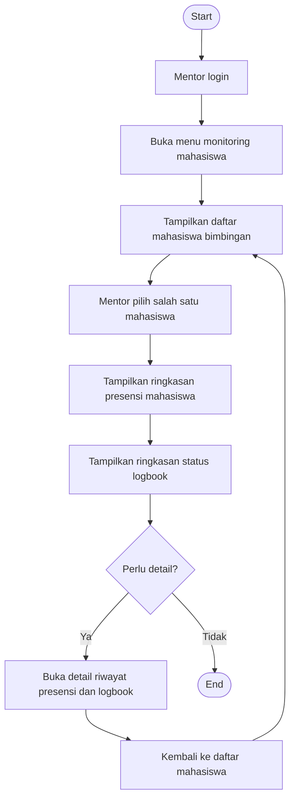

# Flowchart - Mentor - Monitoring Mahasiswa

Fokus fitur ini hanya pada penggunaan mentor untuk memantau progres mahasiswa bimbingan.

## Narasi Singkat

1. Mentor masuk ke menu monitoring untuk melihat mahasiswa yang dibimbing.
2. Mentor memilih mahasiswa lalu memantau progres presensi dan logbook.
3. Jika diperlukan, mentor membuka detail riwayat sebelum kembali ke daftar.
