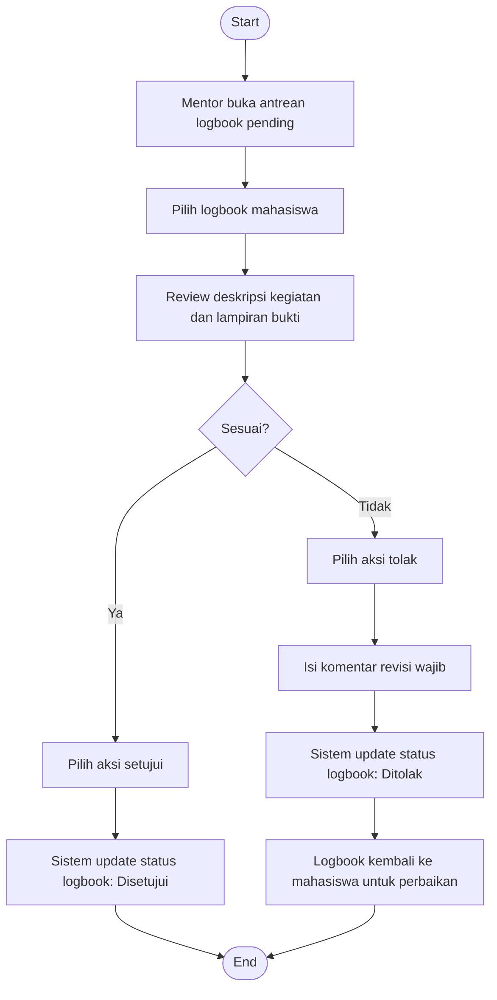

# Flowchart - Mentor - Validasi Logbook

Fokus fitur ini hanya pada penggunaan mentor untuk memvalidasi logbook harian mahasiswa.

## Narasi Singkat

1. Mentor membuka antrean logbook yang menunggu validasi.
2. Mentor meninjau isi aktivitas dan lampiran bukti mahasiswa.
3. Mentor menyetujui jika sesuai, atau menolak dengan komentar revisi jika belum sesuai.
