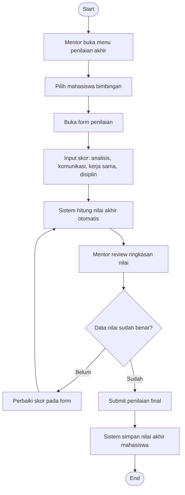

# Flowchart - Mentor - Penilaian Akhir

Fokus fitur ini hanya pada penggunaan mentor untuk input dan finalisasi penilaian akhir mahasiswa.

## Narasi Singkat

1. Mentor memilih mahasiswa dan mengisi skor tiap aspek penilaian.
2. Sistem menghitung nilai akhir secara otomatis berdasarkan skor yang diinput.
3. Mentor meninjau hasil, lalu melakukan final submit jika nilai sudah benar.
