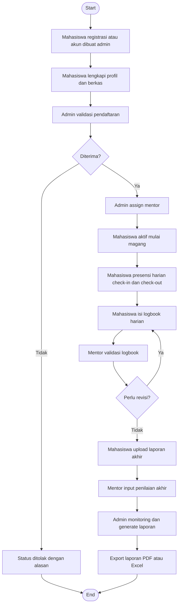

# Flowchart Global MAGIS

Dokumen ini menggambarkan alur global sistem MAGIS dari pendaftaran hingga pelaporan akhir.

## Ringkasan

1. Alur dimulai dari onboarding mahasiswa.
2. Proses operasional utama meliputi presensi, logbook, dan validasi mentor.
3. Alur ditutup dengan penilaian akhir serta pelaporan administratif oleh admin.
