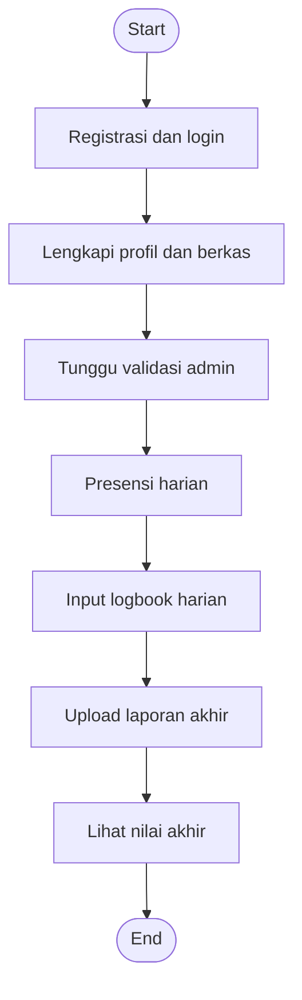
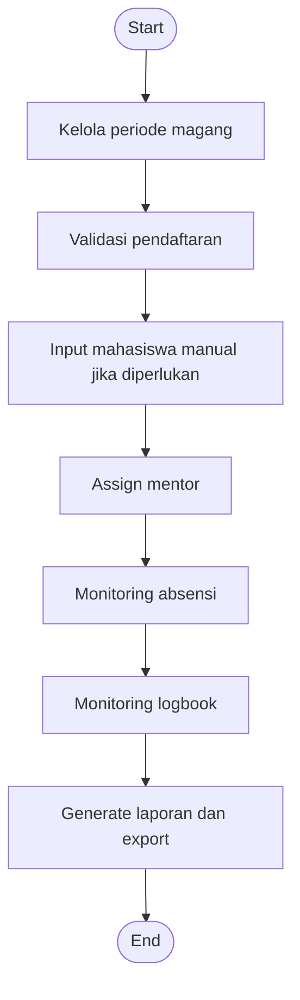
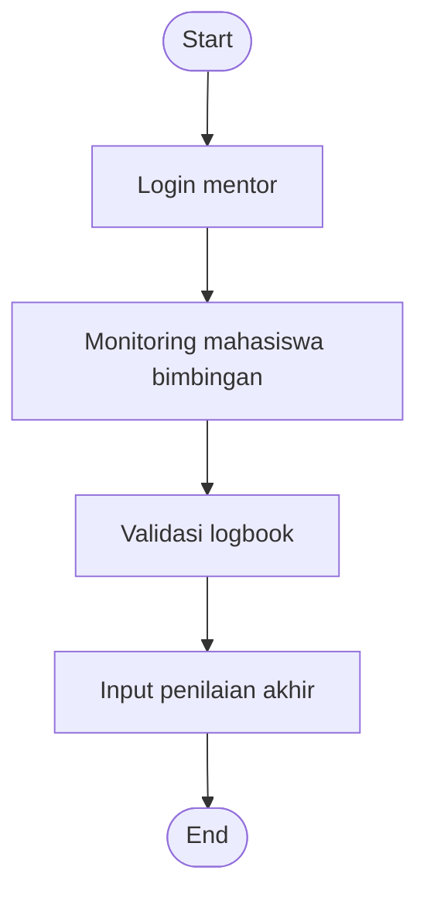

# Flowchart Role-Based MAGIS

Dokumen ini merangkum alur utama tiap role secara terpisah namun tetap saling terhubung.

## 1. Alur Mahasiswa

## 2. Alur Admin

## 3. Alur Mentor

## Ringkasan

1. Mahasiswa fokus pada aktivitas operasional magang.
2. Admin fokus pada kontrol proses dan administrasi.
3. Mentor fokus pada validasi aktivitas dan evaluasi akhir.
